# Full Banking Project
<hr>

## Partie 1 : Front-end

<br>

```markdown
Pour chaque "HTTP Request" on l'envoie au service Gateway "port 9999"
```
<br>


la liste des produits :
<br>

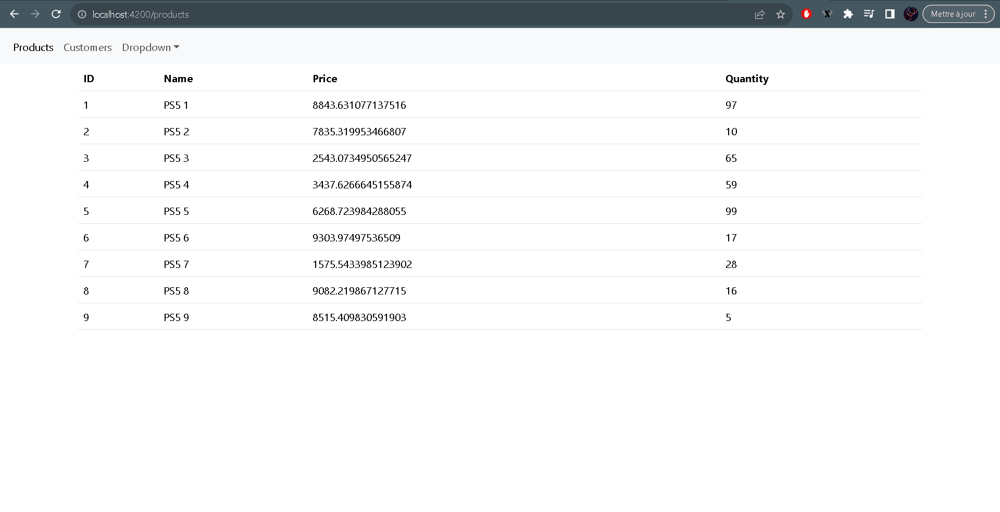

<br>

la liste des clients :
<br>

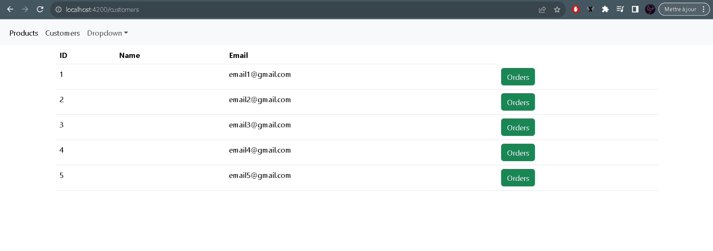

<br>

Chaque client contient une liste des ordres (bouton vert):

<br>

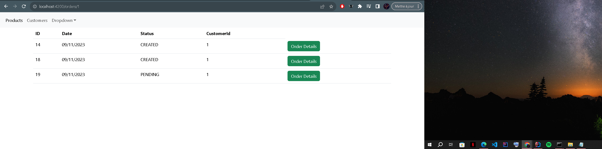

<br>

Cette page contient les details de chaque ordre
<br>

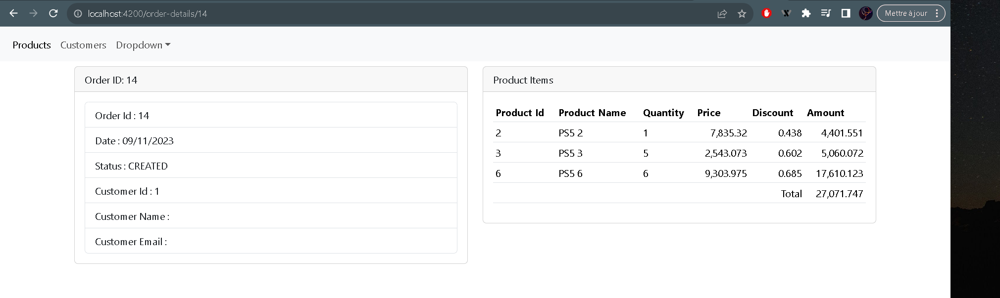

<br>

Pour configurer CORS dans la gateway-service

```markdown
spring:
  cloud:
    gateway:
      globalcors:
        corsConfigurations:
          '[/**]':
            allowedOrigins: "http://localhost:4200"
            allowedHeaders: "*"
            allowedMethods:
              - GET
              - POST
              - PUT
              - DELETE
```

<br>

## Partie 2 : Back-end

Les services sont enregistrés dans Consul :

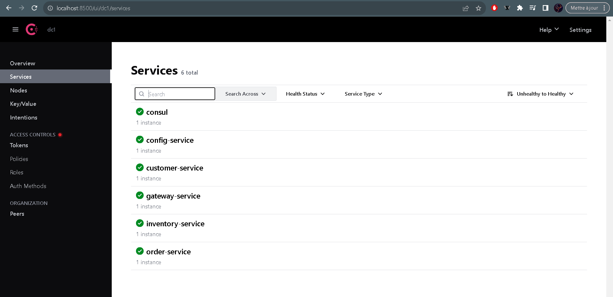

<br>

### 1) Spring Cloud Config

<br>
Pour utiliser Spring Cloud Config il faut tout d'abord ajouter la dependance suivante :

```markdown
<dependency>
  <groupId>org.springframework.cloud</groupId>
  <artifactId>spring-cloud-starter-config</artifactId>
</dependency>
```
<br>

Puis on push la configuration vers GitHub comme le suivant :

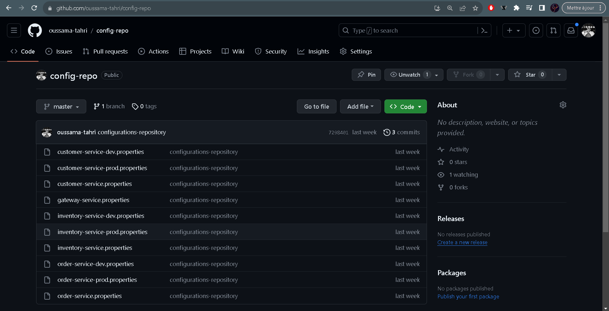

<br>

pour utiliser la configuration dans chaque microservice on doit l'importer :

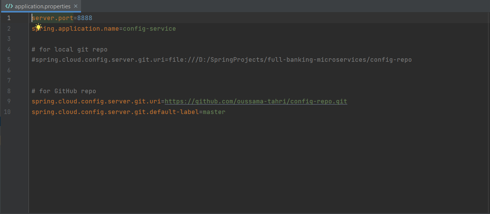

<br>
Et puis on l'active 
<br>

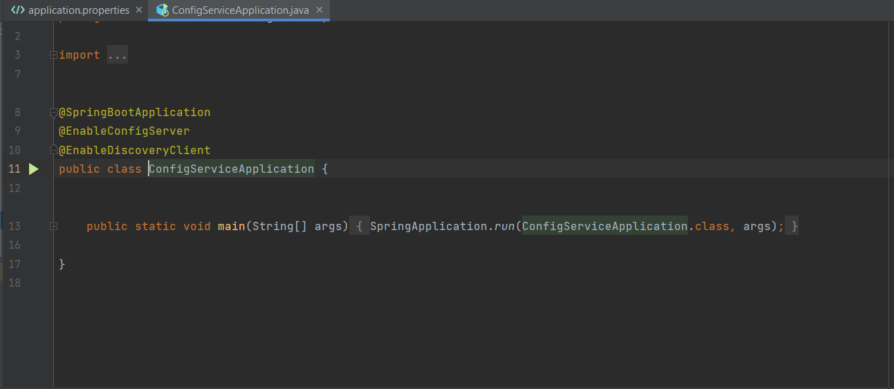

<br>

### 2) Concul Config

<br>
Pour utiliser Concul Config il faut tout d'abord ajouter la dependance suivante :

```markdown
<dependency>
    <groupId>org.springframework.cloud</groupId>
    <artifactId>spring-cloud-starter-consul-config</artifactId>
</dependency>
```
<br>

L'interface Concul où on a enregistrer notre configuration : 
<br>

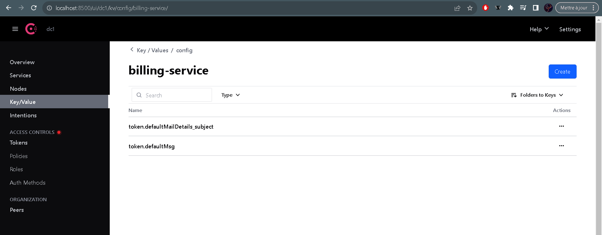

<br>

Pour utiliser la configuration dans chaque microservice on doit l'importer :

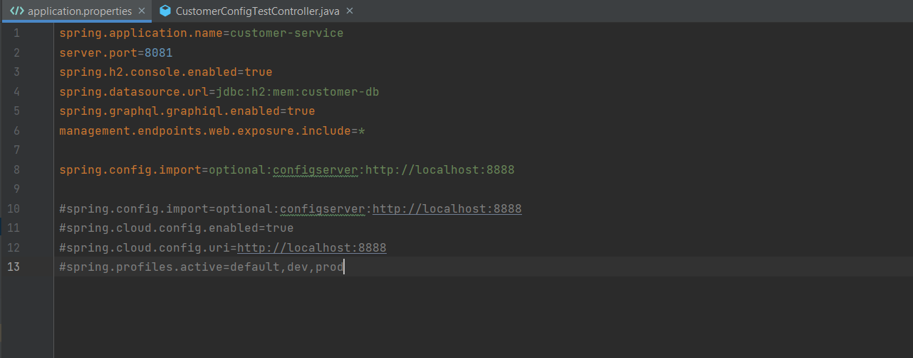

<br>
Et pour tester si la config est bien importé on utilise une class RestController
<br>

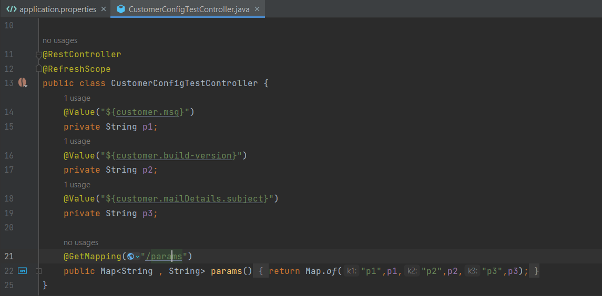

<br>


### 2) Vault Config

<br>
Pour utiliser Vault Config il faut tout d'abord ajouter la dependance suivante :

```markdown
<dependency>
    <groupId>org.springframework.cloud</groupId>
    <artifactId>spring-cloud-starter-vault-config</artifactId>
</dependency>
```
<br>

L'interface Vault où on a enregistrer notre configuration :
<br>

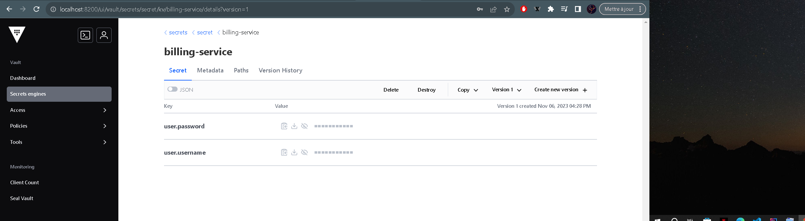

<br>

Pour utiliser la configuration dans chaque microservice on doit la configurer et l'importer :

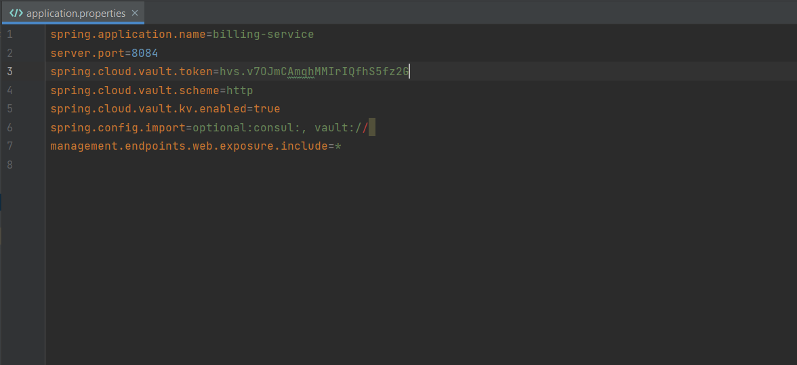

<br>
Et pour tester si la config est bien importé on utilise une class RestController
<br>

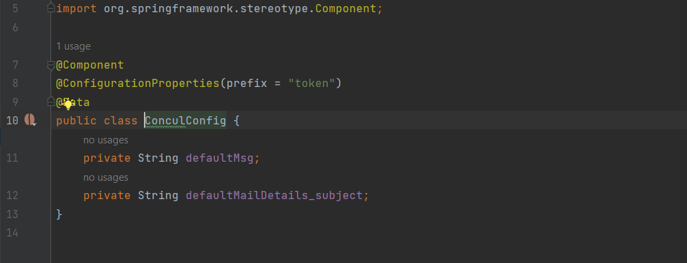

<br>

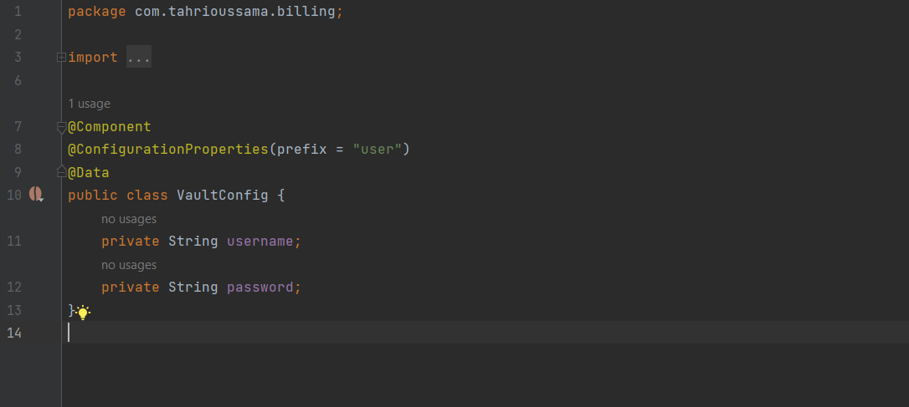

<br>

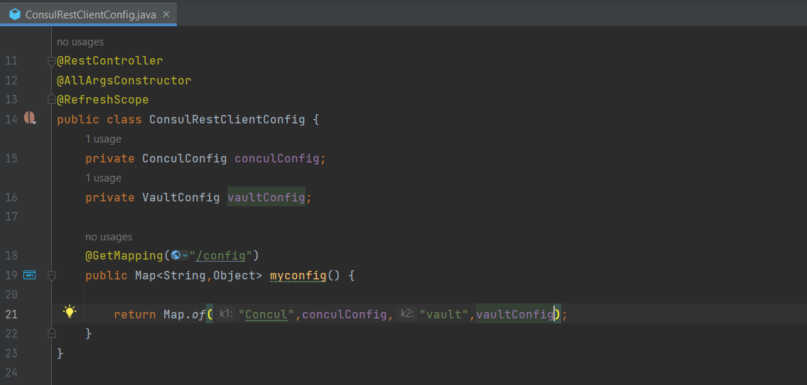

<br>
